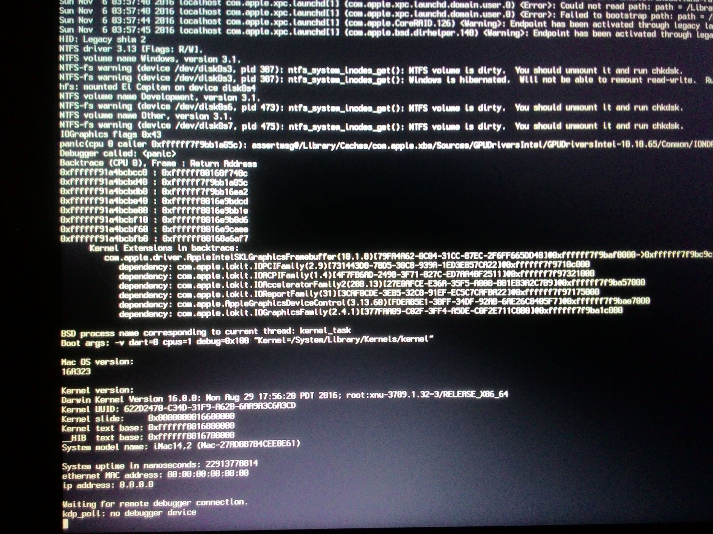
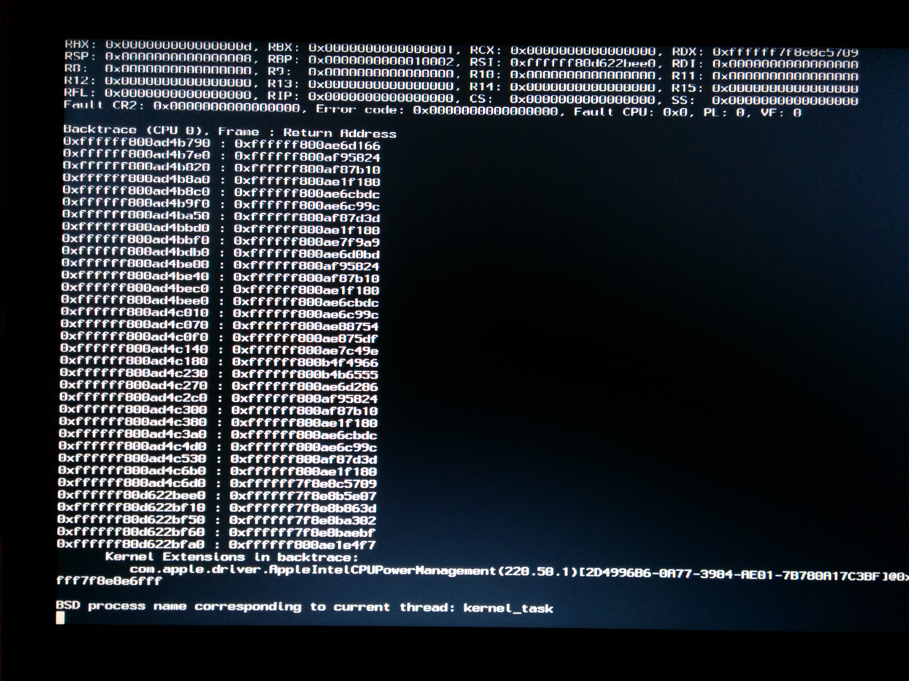
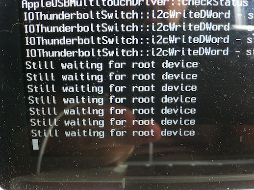
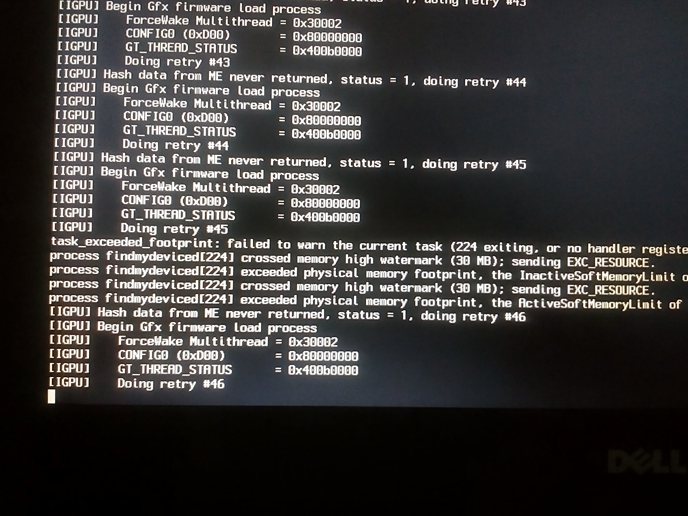

# Detecting error

## Kernel Panic

There are many problem can lead to kernel panic when you install/using hackintosh. Here's some common you can dectect it by yourself

### Outdated kext

At the backtrace, you can clearly see kernel panic causing by your outdated kext (Lilu.kext & AppleALC.kext). So you can boot into Windows and mount your EFI partition by [this way](efi.md) or you can disable inject `outdated kext` by press Space when Clover prepairing to boot and disable kext inject. 

### DVMT-prealloc lower than 64MB

macOS doesn't allow you to boot if you set DVMT-prealloc lower than 64MB. You can set it in BIOS/UEFI settings or if your PC/laptop doesn't allow to set it then you need to install [IntelGraphicsDVMTFixup.kext](https://github.com/BarbaraPalvin/IntelGraphicsDVMTFixup/releases) to bypass it

### AppleIntelCPUPowerManagement

This happened when you enable locked MSR in BIOS/UEFI settings. You need to disable it.

## Still waiting for root device

If you are trying to boot and got something like this then you properly forgot to install `USBInjectAll.kext`

Some case if you have `USBInjectAll.kext` but still got this error then try to add USB port limit patch or try USB 2.0 port

## iGPU Hash Data

Since macOS High Sierra booting with iGPU will need `-disablegfxfirmware` boot flag

This was fixed by [IntelGraphicsFixup.kext](https://github.com/lvs1974/IntelGraphicsFixup/releases) 1.2.5, if you not install it yet or not update to latest version then you should install/update it with latest version of [Lilu.kext](https://github.com/vit9696/Lilu/releases)

