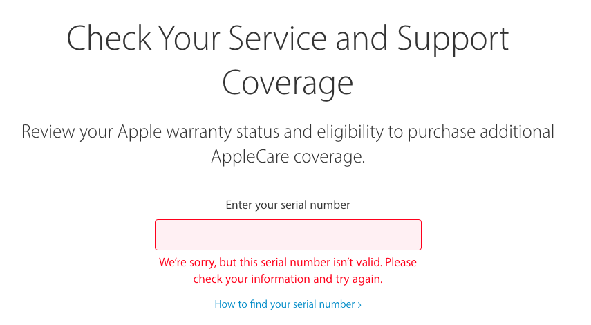
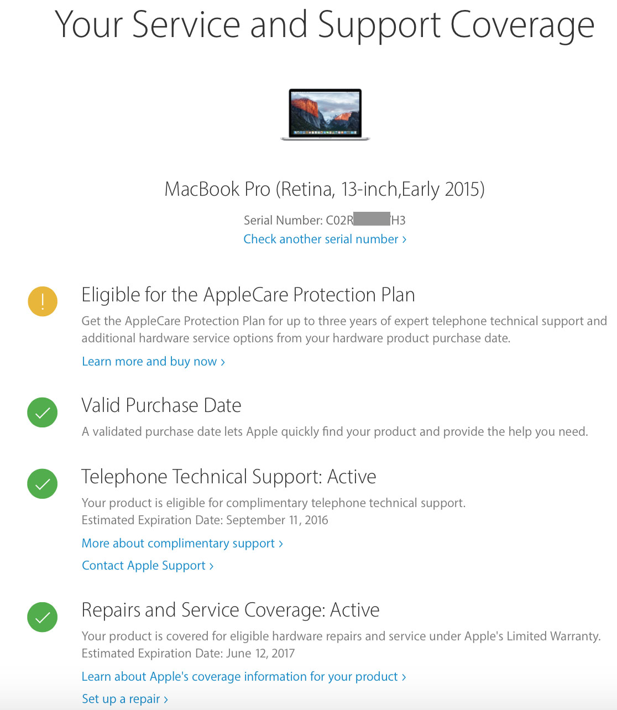

# iMessage & FaceTime

## Requirements:

- Clover Configurator: <http://mackie100projects.altervista.org>
- Working NVRAM

## Step 1: Seting the correct BSD name

Open Terminal and run the following commands: (Warning: This will delete most of your preferences.)

- `sudo rm -rf /Library/Preferences/SystemConfiguration/NetworkInterfaces.plist`
- `sudo rm -rf /Library/Preferences/SystemConfiguration/preferences.plist`

By now, macOS should re-discover all your Network Interfaces and rebuild the network configuration files, hopefully now with the correct BSD names. If the BSD names are still not correct and you have additional add-on PCI or USB NIC's then try removing them and delete the two files again, reboot and let OS X assign the 'built-in' NIC's first, then re-install your add-on NIC's one by one.

You can check your BSD name by System Profiler > Network.

## Step 2: Reset iMessage Configuration files

If you are starting with a clean OS X install then there is no need for you to perform any of the procedures in this chapter. You can skip this step if this is your case.

However if you have been trying to get iMessage to work for sometime and have been using different System ID's and/or Apple_ID's then the chances are that the iMessage configuration and cache files could contain invalid or non-useful data.

By deleting these files we can force iMessage to reset-itself and re-build the configuration files which will force iMessage to re-authenticate it-self with Apples iMessage servers. I always recommend performing this procedure after making any significant changes to OS X's System ID's such as the S/N, SmUUD (System_Id), System Type, MLB & ROM.

Before commencing you should logout of **all** Apple iCloud services and disconnect from your network, then reboot this way OS X will not start the iCloud services and allow us to remove the config files.

Open Terminal, run these commands:

* `sudo rm -rf /StartupDrive/Users/Username/Library/Caches/com.apple.iCloudHelper*`
* `sudo rm -rf /StartupDrive/Users/Username/Library/Caches/com.apple.Messages*`
* `sudo rm -rf /StartupDrive/Users/Username/Library/Caches/com.apple.imfoundation.IMRemoteURLConnectionAgent*`
* `sudo rm -rf /StartupDrive/Users/Username/Library/Preferences/com.apple.iChat*`
* `sudo rm -rf /StartupDrive/Users/Username/Library/Preferences/com.apple.icloud*`
* `sudo rm -rf /StartupDrive/Users/Username/Library/Preferences/com.apple.imagent*`
* `sudo rm -rf /StartupDrive/Users/Username/Library/Preferences/com.apple.imessage*`
* `sudo rm -rf /StartupDrive/Users/Username/Library/Preferences/com.apple.imservice*`
* `sudo rm -rf /StartupDrive/Users/Username/Library/Preferences/com.apple.ids.service*`
* `sudo rm -rf /StartupDrive/Users/Username/Library/Preferences/com.apple.madrid.plist*`
* `sudo rm -rf /StartupDrive/Users/Username/Library/Preferences/com.apple.imessage.bag.plist*`
* `sudo rm -rf /StartupDrive/Users/Username/Library/Preferences/com.apple.identityserviced*`
* `sudo rm -rf /StartupDrive/Users/Username/Library/Preferences/com.apple.ids.service*`
* `sudo rm -rf /StartupDrive/Users/Username/Library/Preferences/com.apple.security*`
* `sudo rm -rf /StartupDrive/Users/Username/Library/Messages`

StartupDrive being the name of the macOS partition and Username being your User name.

## Step 3: Generate SMBIOS value

To generate your SMBIOS, open your `config.plist` file. Press `Generate New` few times, copy your new Series Number and check it on [here](https://checkcoverage.apple.com/)

If you got something like this then it's good.

Now continue to press Generate New few more times, check your new Series Number to Apple's website again.

If you got wrong series number then keep generate again, if you got something like this then copy your old Series Number into your `config.plist`.

Open `Terminal.app`, type `uuidgen` and enter, doing that for 15-20 times.

Copy your latest result and paste to `config.plist - SMBIOS - SmUUID`

## Step 4: Generate ROM value

ROM value is most important value for iMessage service. Mostly all ROM value on real Mac machine based on Thunderbolt port, MAC address from wifi/ethernet.

So we will generate an MAC address based on Apple Inc. vendor, open [this page](http://www.adminsub.net/mac-address-finder/apple) and copy 6 digits random based on Apple Inc.

After that open [this page](https://www.miniwebtool.com/mac-address-generator/) copy your 6 digits you got and set `MAC address format` to `0010FA6E384A` and set to `Uppercase` letter. Now copy your generated MAC address to your ROM value in `config.plist - Rt Variables - ROM`.

After that, save config.plist file and reboot

--------------

Credit: This guide is based from [jaymonkey guide](https://www.tonymacx86.com/threads/how-to-fix-imessage.110471/) and with little research of ROM value from me