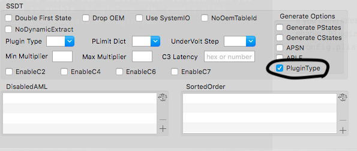
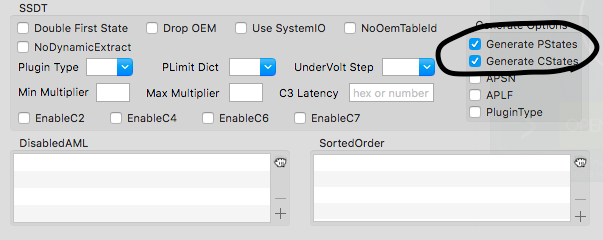

# Power Management

Apple design macOS for their own computer, so macOS doesn't know how to control clock speed on your CPU.

This guide will show you how to make power management working on your hack.

This will also help your hack sleep-albe

## For Haswell or later

If you using latest Clover Bootloader version then you just need to enable `PluginType` in `config.plist - Acpi - SSDT - Generate - PluginType`

## For Ivy Bridge or older/X299, X99

Open Terminal.app, type this to download ssdtPRGen.sh:

`curl -o ~/ssdtPRGen.sh https://raw.githubusercontent.com/Piker-Alpha/ssdtPRGen.sh/Beta/ssdtPRGen.sh
`

This will download ssdtPRGen.sh to your home directory (~) and the next step is to change the permissions of the file (add +x) so that it can be run.

`chmod +x ~/ssdtPRGen.sh`

Now run it

`sudo ~/ssdtPRGen.sh`

If the script asking you to open ssdt.dsl, press No.

Now you can see there's an `ASL Output` location, use Finder and copy that `ssdt.aml` file to `/EFI/Clover/ACPI/patched/` and rename to `SSDT-PM.aml`

You can also use this way to generate Power Management for Haswell or later gen.

## For 1st generation

If you using latest Clover Bootloader version then you just need to enable `Generate PStates` and `Generate CStates` in `config.plist - Acpi - SSDT - Generate`

