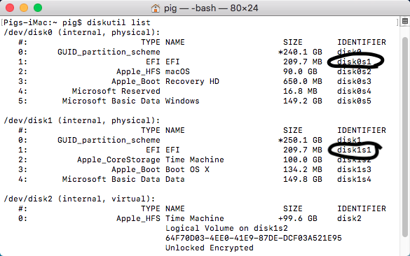

# Tips

## Install High Sierra without using APFS

[This guide](https://www.tonymacx86.com/threads/guide-avoid-apfs-conversion-on-high-sierra-update-or-fresh-install.232855/) will help you to install macOS High Sierra without using APFS

## Force T.R.I.M.

[What is T.R.I.M.](https://en.wikipedia.org/wiki/Trim_(computing))? SSD from real Mac computer will enable T.R.I.M. without `forcetrim` but if you using other SSD then you will need to enable it.

Note:

- Do not enable `forcetrim` on APFS file-system. If your SSD supported T.R.I.M. on APFS then it'll enable. Trying to use `forcetrim` will causing 30s boot time on SSD when using APFS. If you want then you can re-install macOS with HFS+J by [this way](https://www.tonymacx86.com/threads/guide-avoid-apfs-conversion-on-high-sierra-update-or-fresh-install.232855/)

To enable it, open `Terminal.app`, type `sudo trimforce enable` and enter. Follow the instructions to complete.

## darkwake boot flag

Here's some [research about darkware](https://www.tonymacx86.com/threads/darkwake-deciphered.236850/) boot flag, you can choose darkwake value 1,2,3 to make your hack sleep better. According to this research, other value are useless now.

## Check NVRAM

If you using AptioMemoryFix.efi then you don't need to check this, AMF.efi can fix native NVRAM. In case your computer don't have native NVRAM support, then you can check it.

Open the terminal and do the following one line at a time:

```
sudo -s
nvram -c
nvram myvar=test
exit
```

Reboot

```
nvram -p | grep -i myvar
```

If you get any output from that last command (after a reboot) then your NVRAM works!  If not - you may need to install EmuVariableUefi-64.efi and the RC Scripts via the Clover installer package.

## How to mount EFI partition

### macOS

You can easily mount EFI partition by using Clover Configurator, but if you don't have internet to download it. Here's how to mount EFI partition by `Terminal.app`

- Open `Terminal.app`, type `diskutil list` and enter. Find your EFI partition identifier number



- Once you found it, type `sudo mkdir /Volumes/EFI` to make a mount point
- Now you can mount EFI partition to that point by this command `sudo mount -t msdos /dev/disk0s1 /Volumes/EFI` (edit `disk0s1` to your partition identifier number)

### Windows

On Windows, I only can find a way to mount EFI partition in your main hard drive which mean you can't mount EFI partition from your USB.

- Open Command Prompt or Windows PowerShell, type `mountvol X: /s`
- Now it's mounted, but Windows Explorer not allow you to touch that EFI partition so you can use [Explorer++](https://explorerplusplus.com/) to edit it

### Linux

On Ubuntu, there's a disk management program can let you mount EFI without any problem. But if you not using Ubuntu or don't have that program, you can use `Terminal` to mount it

- Type `sudo fdisk -l`, this should produce output that identifies the ESP (among other things).
- Identify your ESP; it should specify EFI System in the Type column. In this example, it's /dev/sda1. (The ESP is usually /dev/sda1 or /dev/sda2, but that's just what's most common.)
- With the ESP identified, mount it to /mnt, as in sudo mount /dev/sda1 /mnt. If you prefer, you can create a mount point other than /mnt and mount the ESP there. This might be necessary if you want to mount multiple partitions.

